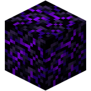
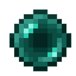
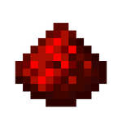

### [[English]](Readme.MD) [[Russian]](ReadmeRU.MD)

# TeleportBlock

**Версия:** 1.0.0  
**Автор:** [@lovenek0](https://github.com/lovenek0)  
**Совместимость:** Bukkit API 1.21

## Описание
`TeleportBlock` — это плагин для Minecraft, который добавляет два новых предмета: **Блок телепортации** и **Компас телепортации**. Эти предметы позволяют игрокам привязывать компас к определённому блоку и телепортироваться к нему спустя небольшую задержку.

## Установка
1. Скачайте `TeleportBlock.jar`.
2. Поместите файл в папку `plugins` вашего сервера.
3. Запустите сервер для автоматической генерации конфигурации (`config.yml`).

## Конфигурация
После первого запуска в папке `plugins/TeleportBlock` создаётся файл `config.yml`.

### Параметры
```yaml
teleport-delay: 3000  # Задержка перед телепортацией (в миллисекундах)
cancel-timeout: 350   # Время до отмены телепортации при отсутствии взаимодействий (в миллисекундах)
language: "ru"        # Язык сообщений (доступны "en" и "ru")

languages:
  en:
    teleportBlockName: "Teleportation Block"
    teleportCompassName: "Teleportation Compass"

  ru:
    teleportBlockName: "Блок телепортации"
    teleportCompassName: "Компас телепортации"
```

## Крафты
### Блок телепортации
#### Ингредиенты:
- `Плачущего обсидиана: 8`
- `Эндер-жемчуг: 1`

#### Расположение:




<br>



<br>


### Компас телепортации
#### Ингредиенты:
- `Железных слитка: 4`
- `Редстоун: 1`
- `Эндер-жемчуг: 1`

#### Расположение:


<br>



<br>


## Использование
### Установка блока телепортации
1. Создайте **Блок телепортации** и разместите его в нужном месте.
2. Блок автоматически сохранит своё местоположение.

### Привязка компаса
1. Возьмите **Компас телепортации** в руку.
2. **ПКМ** по **Блоку телепортации**, чтобы привязать компас к нему.

### Телепортация
1. Держите **Компас телепортации** в основной руке.
2. **ПКМ** в воздухе, чтобы активировать телепортацию.
3. Ожидайте (по умолчанию 3 секунды) без движения.
4. Если в течение этого времени не будет отмены, произойдёт телепортация.

## Дополнительные функции
- Если игрок отпускает ПКМ или двигается во время телепортации, она отменяется.
- Блоки телепортации сохраняются даже после перезапуска сервера.
- При разрушении блока телепортации он дропается с тем же идентификатором.
- Если попытаться телепортироваться к удалённому блоку, будет проигран звук ошибки.
